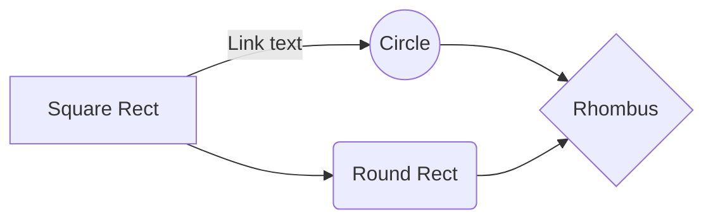

# This is a test

Hello world



```pascal
program new;

type
  EConvexityDefects = (cdNone, cdAll, cdMinimal);

(*
  Finds the defects in relation to a convex hull of the given concave hull.
  cdAll     -> Keeps all convex points as well.
  cdMinimal -> keeps the convex points that was linked to a defect
  cdNone    -> Only defects
*)
function ConvexityDefects(ConcavePoly: TPointArray; Epsilon: Single; Mode:EConvexityDefects=cdNone): TPointArray;
var
  x,y,i,j,k: Int32;
  dist, best: Single;
  pt: TPoint;
  convex: TPointArray;
begin
  convex  := ConcavePoly.ConvexHull();

  for x:=0 to High(ConcavePoly) do
  begin
    i := convex.IndexOf(ConcavePoly[x]);

    if i <> -1 then
    begin
      j := (i+1) mod Length(convex);
      y := ConcavePoly.IndexOf(convex[j]);

      best := 0;
      for k:=y to x do
      begin
        dist := DistToLine(ConcavePoly[k], convex[i], convex[j]);
        if (dist > best) then
        begin
          best := dist;
          pt := ConcavePoly[k];
        end;
      end;

      if best >= Epsilon then
      begin
        if (Mode = cdMinimal) and ((Length(Result) = 0) or (Result[High(Result)] <> convex[j])) then Result += convex[j];
        Result += pt;
        if Mode = cdMinimal then Result += convex[i];
      end;

      if Mode = cdAll then
        Result += convex[i];
    end;
  end;
end;


var
  bmp: TImage;
  defects,convex,concave, TPA: TPointArray;
  i,j,x,y,k: Int32;
  best,d: Single;
  pt,lpt,mean: TPoint;
begin
  bmp := TImage.CreateFromFile('images/hand.png');
  //TPA := bmp.Finder.FindColor($0, 5);
  TPA := bmp.Finder.FindColor(6908265, 4, EColorSpace.LCH, [5,1,9]);
  TPA := TPA.Cluster(1).Largest();

  bmp.Clear();
  bmp.DrawTPA(TPA,$444444);

  for concave in TPA.ConcaveHullEx(1) do
  begin
    defects  := ConvexityDefects(concave, 3, cdMinimal);

    bmp.DrawPolygon(concave.ConvexHull(), 255);
    //bmp.DrawPolygon(concave, $00FF00);
    bmp.Show();

    for i:=0 to High(defects) do
      bmp.DrawCircleFilled([defects[i].x, defects[i].y, 3], $FFFFFF);

    bmp.DrawPolygon(defects, $00FF00);
    bmp.Show();
  end;
end.
```
